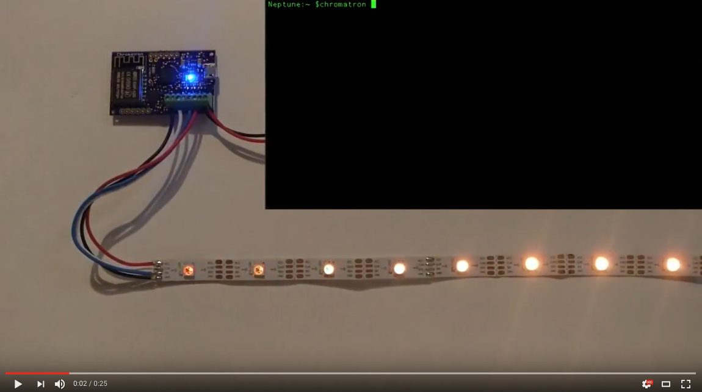
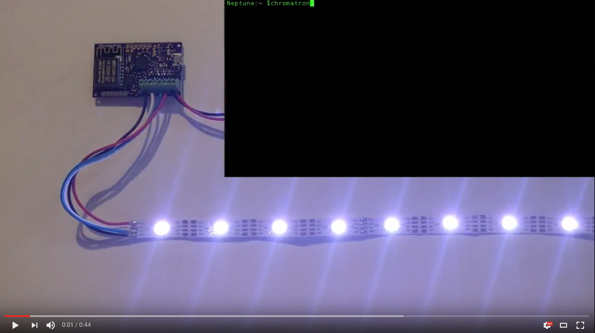

Chromatron API Examples
=======================

`Chromatron Wifi Pixel Controller <http://chromatron.io>`_

FX Script
---------

Rainbow
^^^^^^^

.. image:: img/screenshot_rainbow.png
    :target: https://youtu.be/3myK_MlTOAU

.. code-block:: python

    # rainbow.fx

    # this script generates a rolling rainbow pattern

    # declare a global variable for current hue
    current_hue = Number()

    # init - runs once when script is loaded
    def init():
        # set pixels to full colors (maximum saturation)
        pixels.sat = 1.0

        # set to maximum brightness
        pixels.val = 1.0

    # runs periodically, frame rate is configurable
    def loop():
        # increment the base hue so the rainbow pattern
        # shifts across the pixels as we go from one frame
        # to the next.
        current_hue += 0.005

        # declare a local variable
        a = Number()
        a = current_hue

        # loop over all pixels in array
        for i in pixels.count:
            pixels[i].hue = a
            
            # shift color for next pixel.
            # this will distribute the rainbow pattern
            # across the entire array.
            a += 1.0 / pixels.count

Chaser
^^^^^^

.. code-block:: python

    # chaser.fx

    # declare a global variable for current hue
    current_hue = Number()

    # declare another variable for the cursor
    cursor = Number()

    # init - runs once when script is loaded
    def init():
        # set pixels to full colors (maximum saturation)
        pixels.sat = 1.0

        # set pixels default hue to red
        pixels.hue = 0.0

        # set to off
        pixels.val = 0.0

        # set color fades to 500 milliseconds
        pixels.hs_fade = 500

    # runs periodically, frame rate is configurable
    def loop():
        
        # turn off all pixels with a 500 ms fade
        pixels.v_fade = 500
        for i in pixels.count:
            if pixels[i].is_fading == False:
                pixels[i].val = 0.0

        # turn on pixels at cursor, with a 200 ms fade
        pixels[cursor].v_fade = 200
        pixels[cursor].val = 1.0

        # change color of pixel
        pixels[cursor].hue = current_hue

        # increment cursor
        cursor += 1

        # adjust color
        current_hue += 0.005

Network Control
^^^^^^^^^^^^^^^

.. code-block:: python

    # hsv_control.fx

    # declare variables and publish to network
    hue = Number(publish=True)
    sat = Number(publish=True)
    val = Number(publish=True)

    # init - runs once when script is loaded
    def init():
        # set startup defaults
        hue = 0.0
        sat = 0.4
        val = 1.0

    # runs periodically, frame rate is configurable
    def loop():
        # continually apply network variables to pixel array
        pixels.val = val
        pixels.sat = sat
        pixels.hue = hue

Command Line
------------

.. code:: bash

    # Install Python library
    pip install chromatron

    # Discover devices in living room
    chromatron --query living_room discover

    # Load rainbow FX script to previous group
    chromatron vm load rainbow.fx

    # Set master dimmer to 50%
    chromatron dimmer master 0.5
                  

Python
------

.. code-block:: python

    from chromatron import *

    # Discover devices in living room
    group = DeviceGroup('living_room')

    # Load rainbow effect script
    group.load_vm('rainbow.fx')

    # Set master dimmer to 50%
    group.dimmer = 0.5
                  
