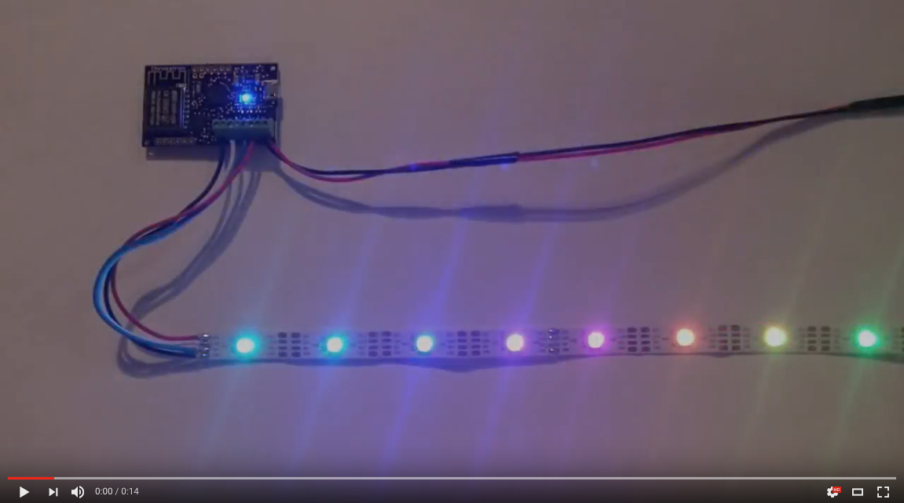

Chromatron API Examples
=======================

FX Script
---------

Rainbow
^^^^^^^

.. code-block:: python

    # rainbow.fx

    # this script generates a rolling rainbow pattern

    # declare a global variable for current hue
    current_hue = Number()

    # init - runs once when script is loaded
    def init():
        # set pixels to full colors (maximum saturation)
        pixels.sat = 1.0

        # set to maximum brightness
        pixels.val = 1.0

    # runs periodically, frame rate is configurable
    def loop():
        # increment the base hue so the rainbow pattern
        # shifts across the pixels as we go from one frame
        # to the next.
        current_hue += 0.005

        # declare a local variable
        a = Number()
        a = current_hue

        # loop over all pixels in array
        for i in pixels.count:
            pixels[i].hue = a
            
            # shift color for next pixel.
            # this will distribute the rainbow pattern
            # across the entire array.
            a += 1.0 / pixels.count

Command Line
------------

.. code:: bash

    # Install Python library
    pip install chromatron

    # Discover devices in living room
    chromatron --query living_room discover

    # Load rainbow FX script to previous group
    chromatron vm load rainbow.fx

    # Set master dimmer to 50%
    chromatron dimmer master 0.5
                  

Python
------

.. code-block:: python

    from chromatron import *

    # Discover devices in living room
    group = DeviceGroup('living_room')

    # Load rainbow effect script
    group.load_vm('rainbow.fx')

    # Set master dimmer to 50%
    group.dimmer = 0.5
                  
