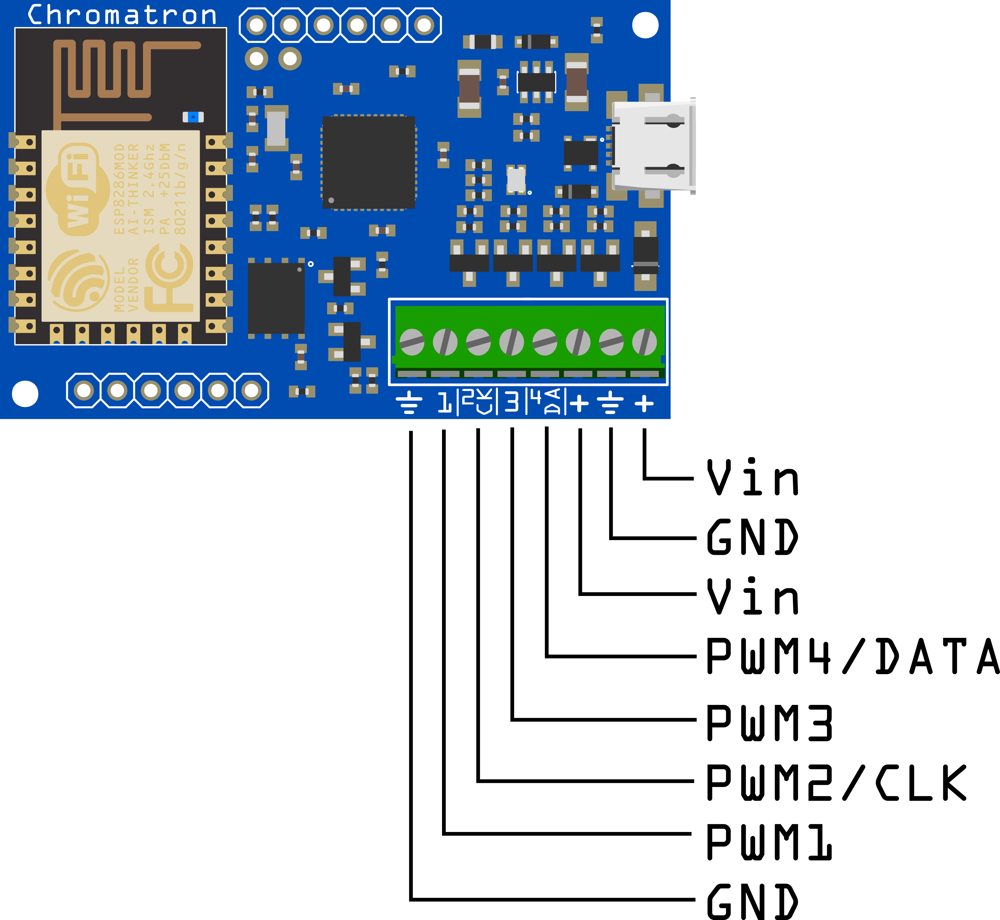
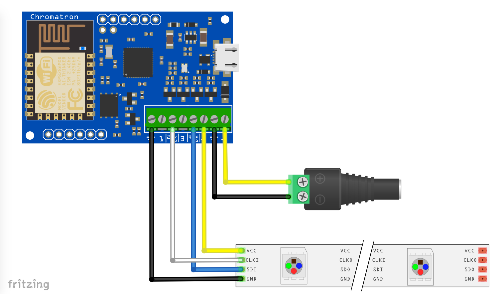
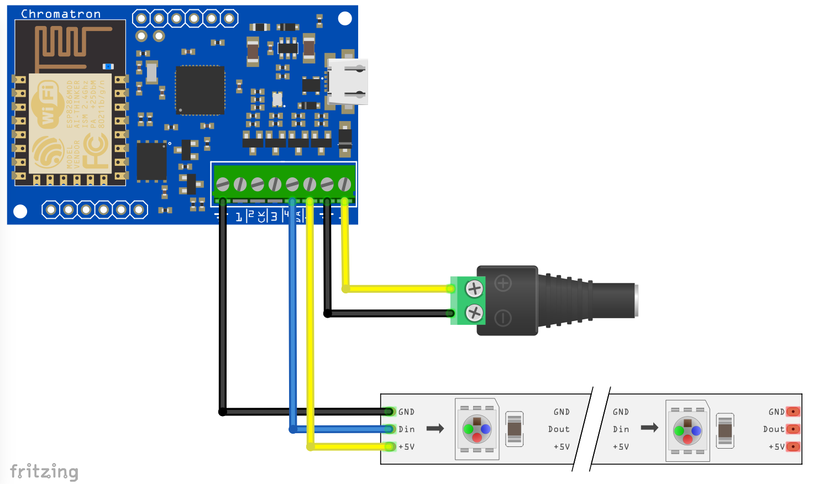
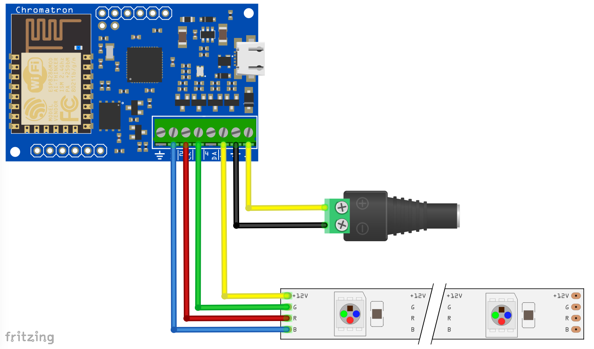

Hardware Guide
==============

Pinouts
---------------

Power
^^^^^

**Vin** - 4 to 16V power supply connection

Vin must match the supply voltage required for the LEDs.  Thus, if you are using 5V LEDs, Vin needs to be 5V.  The same goes with 12V LEDs.

.. warning::
    Double check your supply voltage before powering on for the first time! If you're powering Chromatron on 12V and plug in 5V LEDs, you're going to damage the LED strip (Chromatron itself will be fine).

.. note::
    Note that in the case of the WS2811 at 12V, the data and clock drivers with automatically limit their output to less than 6V (the WS2811 power is 12V, but signalling is nominally 5V).

**GND** - Ground connection

There are two sets of power pins. Both Vins and both GNDs are shorted together in the PCB with thick traces.  You can supply power to the board with one set, and use the other as power connections for the LED strip.

IO
^^

**PWM1** - PWM output for analog pixel mode

**PWM2/CLK** - PWM output or pixel clock, depending on pixel strip mode.

**PWM3** - PWM output for analog pixel mode

**PWM4/DATA** - Pixel data output. This can also be a spare PWM channel, however, this is not yet supported in the current firmware version.

LED Connections
---------------

4 Wire (APA102, WS2801)
^^^^^^^^^^^^^^^^^^^^^^^

4 wire LED strips use one set of power connections, data, and clock.

3 Wire (WS2812, WS2812b, WS2811, Pixie)
^^^^^^^^^^^^^^^^^^^^^^^^^^^^^^^^^^^^^^^

3 wire LED strips use one set of power connections and data. Clock is not used.

PWM
^^^

PWM strips use PWM1, PWM2, and PWM3. Connect on of the Vin connections to the strip's power input. You do not need to worry about the RGB order, it is configurable in software.

Specifications
--------------

**Vin** - 4V to 16V

**PWM channels** - Max. 3 amps each

**Pixel channels** - 320 addressable channels

